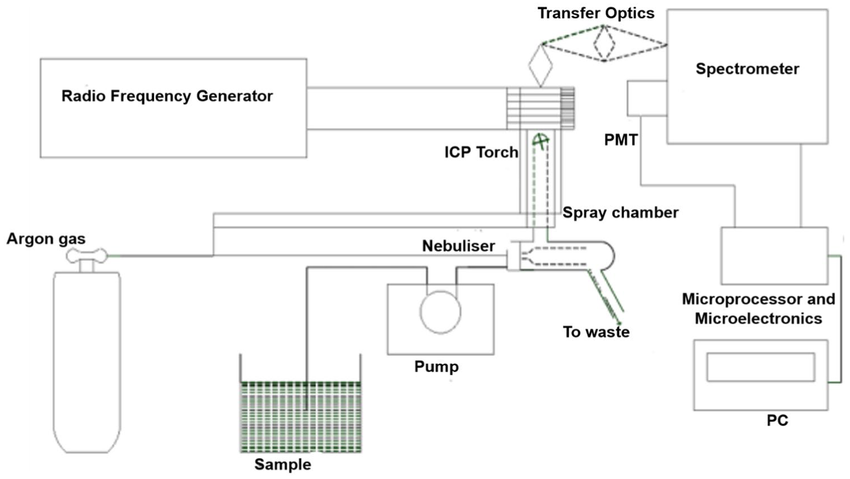
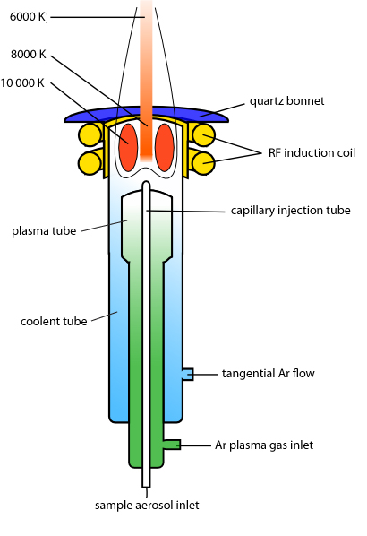
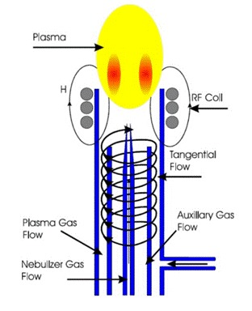
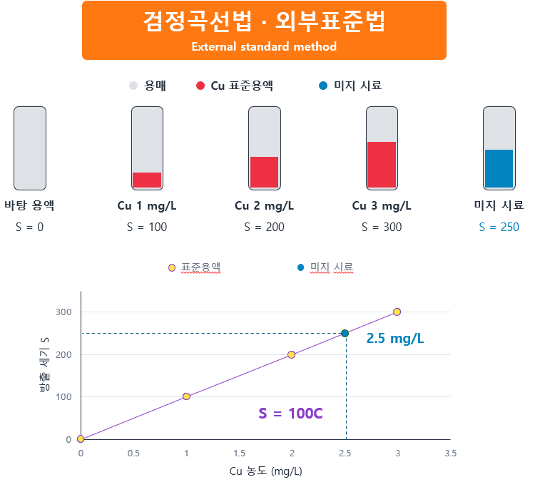
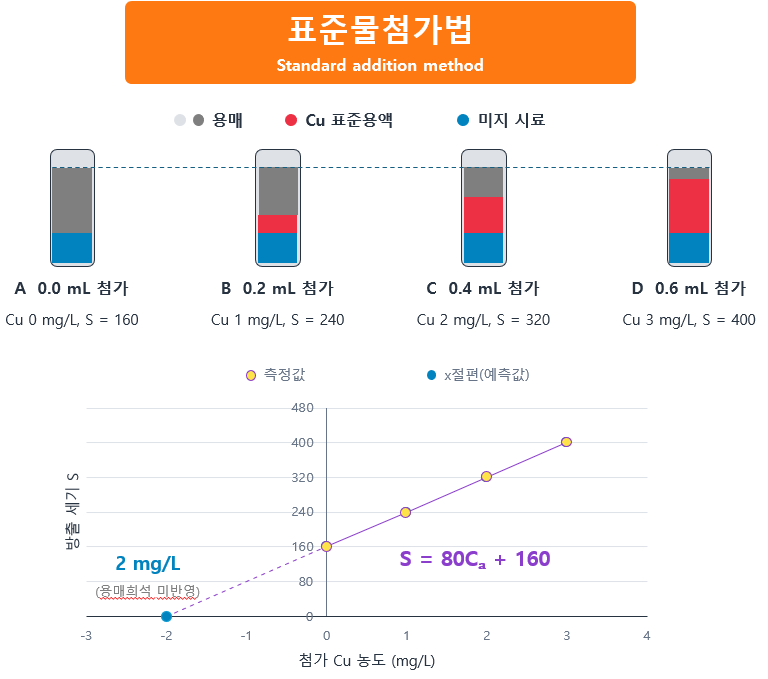
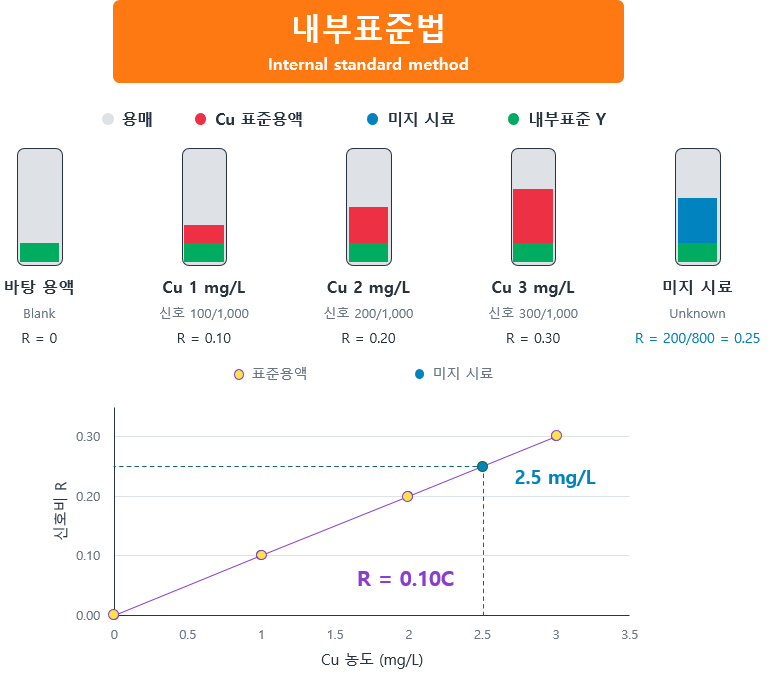
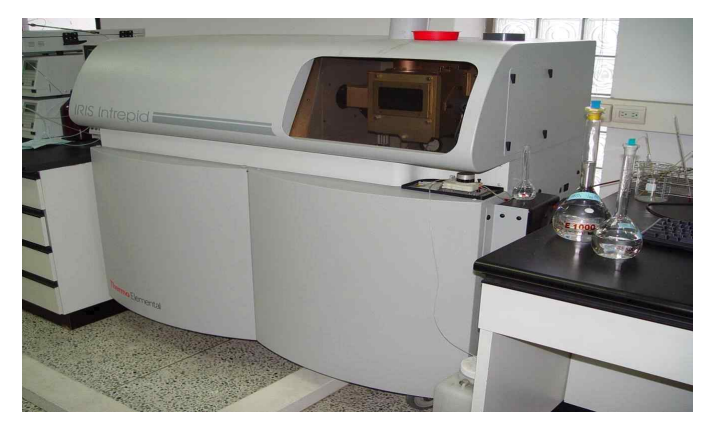

# ICP-OES를 이용한 구리와 카드뮴의 동시분석

**분석화학실험 8조 · 부록 및 참고문헌**

## 목차

1. [실험 목적](#purpose)
2. [전처리](#pretreatment) · [분석 원리](#principle) · [장치 구성](#instrument)
3. [ICP 토치](#torch) · [아르곤의 역할](#argon)
4. [검정곡선법·표준물첨가법·내부표준법](#quantitation)
5. [독성학적 고찰](#results)
6. [기기·시약·측정 파장·실험 방법](#procedure)
7. [참고문헌](#references)

## 1. 실험 목적

다양한 시료에 포함된 원소의 종류와 함량을 파악하는 것은 시료의 화학적 조성을 이해하고, 나아가 산업 현장에서 원료와 제품의 품질 및 안전성을 평가하는 기초가 된다. 본 실험에서는 이러한 원소 분석에 활용되는 ICP-OES를 이용하여 카드뮴(Cd)과 구리(Cu)의 방출 세기의 변화를 확인하고, 검량선을 통해 미지 시료의 농도를 결정하는 정량분석의 원리를 익히고자 한다. 또한 시료 전처리의 필요성과 측정 시 발생할 수 있는 오차 요인을 이해하고자 한다.

## 2. 실험 이론

### 2.1 시료 전처리의 목적

시료 전처리의 목적은 원시료를 ICP-OES로 측정하기 적합한 상태로 만들고, 분석 대상인 Cd와 Cu의 손실과 외부 오염을 최소화하면서 분석용액으로 회수하는 데 있다. 단순히 눈에 보이는 이물질을 제거하는 것에 그치지 않고, 시료의 대표성을 확보하고 측정에 영향을 주는 조건을 조절하여 신뢰할 수 있는 분석 결과를 얻기 위한 과정이다.

본 실험에서는 질산을 활용한 산 분해법으로 전처리를 수행한다. 질산은 적절한 가열 조건에서 유기물을 산화·분해하고, 시료 성분의 용해를 도와 Cd와 Cu를 균일한 분석 용액으로 회수하는 데 사용된다. 이를 통해 금속이 잔류물에 남아 측정값이 낮아지거나, 시료의 불균일성과 잔류 입자로 인해 분석 신호가 불안정해지는 등 분석 과정에서 생길 수 있는 정량 오차를 최소화하고자 한다.

### 2.2 ICP-OES의 원리

유도 결합 플라즈마 광방출 분광법(ICP-OES)은 고주파 유도 코일로 유도 결합 에너지를 전달하여 대기압에서 수천 K의 고온 아르곤 플라즈마를 형성하고, 여기에 도입된 시료의 원자와 이온이 방출하는 빛을 이용하여 농도를 측정하는 분석법이다. 여기된 원자와 이온이 낮은 에너지 준위로 전이할 때 방출하는 고유 파장의 빛을 분광기로 분리하고 검출하여 분석에 이용하며, 고온 플라즈마를 에너지원으로 사용하므로 한 번의 시료 주입으로 여러 원소를 동시에 분석할 수 있다.

### 2.3 장치 구성과 작동 원리

*ICP-OES 전체 장치 구성도 · 이미지를 선택하면 원본 크기로 확인 가능*

#### 1) Sample → Pump (시료 공급)

펌프는 시료 용액을 일정한 속도로 공급한다. 일반적으로 사용하는 연동펌프(peristaltic pump)는 회전하는 롤러가 탄성 튜브를 순차적으로 눌러 내부의 용액을 이동시키는 방식으로 작동한다.

연동펌프를 사용하면 산으로 전처리된 시료가 펌프 내부 부품에 직접 닿지 않고 튜브 안에서 이동하므로 산성 용액을 비교적 안정적으로 공급할 수 있다.

#### 2) Nebulizer (분무기)

분무기에서는 액체 시료와 아르곤 기체가 함께 유입된다. 액체 시료를 그대로 도입할 경우 플라즈마가 불안정해지고 원자화가 균일하게 일어나기 어려우므로 빠르게 흐르는 아르곤 기체를 이용하여 시료 용액을 미세한 액적으로 분무하고, 이를 아르곤 기체에 실린 에어로졸 형태로 변환하여 공급한다.

#### 3) Spray chamber (스프레이 챔버)

분무기에서 생성된 에어로졸은 액적의 크기가 일정하지 않다. 큰 액적이 플라즈마로 유입되면 용매 부하가 증가하여 플라즈마의 온도와 에너지 전달이 불균일해질 수 있다.

스프레이 챔버는 에어로졸 흐름의 방향을 바꾸거나 회전시켜 큰 액적을 제거한다. 관성이 큰 액적은 흐름을 따라가지 못하고 벽에 부딪힌 후 폐액 배출구(To Waste)로 배출되며, 작은 액적은 아르곤 기체의 흐름을 따라 토치로 이동한다.

#### 4) RF generator (고주파 전력 발생 장치)

고주파 전력 발생 장치는 토치 바깥의 코일에 고주파 교류 전류를 공급하여 시간에 따라 변화하는 전자기장을 형성한다. 자세히 살펴보면, 먼저 플라즈마 점화 과정에서 스파크에 의해 일부 아르곤 원자가 이온화되어 자유 전자가 생성된다. 이 전자들이 전자기장에 의해 가속된 후 다른 아르곤 원자와 충돌하면서 추가적인 이온화를 일으킨다. 이와 같은 연쇄적인 이온화 과정으로 아르곤 플라즈마가 형성되고, 이후 코일을 통해 고주파 에너지가 지속적으로 전달되며 플라즈마가 유지된다.

#### 5) ICP torch (플라즈마 토치)

에어로졸 형태로 운반된 시료는 토치 내부의 플라즈마에서 탈용매화와 기화를 거쳐 원자화되며, 일부는 이온화된다. 생성된 원자와 이온은 플라즈마의 에너지를 받아 여기된다.

여기된 원자와 이온은 낮은 에너지 준위로 전이하면서 에너지 차이에 해당하는 고유 파장의 빛을 방출한다.

#### 6) Transfer optics (집광 광학계)

렌즈와 반사경 등을 이용하여 플라즈마에서 여러 방향으로 방출된 빛을 모으고, 초점을 맞추어 분광기의 입구로 전달한다

#### 7) Spectrometer (분광기)

플라즈마에서 방출된 빛에는 시료에 포함된 여러 원소의 방출선이 섞여 있다. 분광기는 회절격자(diffraction grating) 등을 이용하여 이 빛을 파장별로 분리한다.

회절격자의 촘촘한 홈에서 빛이 회절ᆞ간섭하면, 빛이 파장에 따라 서로 다른 방향으로 분리되어 검출기에서 특정 파장의 세기를 측정할 수 있다.

#### 8) PMT (광전자증배관)

광전자증배관은 다음과 같은 순서로 광자를 전자로 변환한 후, 전자 수를 증폭하여 약한 빛을 검출한다.

  1) 선택된 파장의 광자가 광전면(photocathode)에 도달한다.

  2) 광전 효과에 의해 광전자가 방출된다.

  3) 방출된 전자가 첫 번째 다이노드(dynode)에 충돌한다.

  4) 다이노드에서 여러 개의 2차 전자가 방출되며, 이 과정이 여러 다이노드에서 반복된다.

  5) 증폭된 전자가 양극(anode)에 모여 전류 신호를 형성한다.

#### 9) Microelectronics → PC (신호 처리)

전자 회로와 PC는 광전자증배관에서 출력된 전기적 신호를 처리하고, 검량선을 이용하여 시료의 농도를 계산한다.

### 2.4 ICP 토치

*ICP 토치 구조와 온도 분포 · 이미지를 선택하면 원본 크기로 확인 가능*

ICP 토치(torch)는 ICP-OES에서 아르곤 플라즈마가 안정적으로 형성·유지되도록 하고, 시료를 플라즈마 내부로 도입하는 구성 요소이다. 토치는 외부관(outer tube), 중간관(intermediate tube), 중앙의 주입기(injector)로 구성되며, 주변에는 플라즈마에 고주파 에너지를 전달하는 RF 코일이 위치한다.

외부관과 중간관은 플라즈마가 형성되는 공간을 둘러싸며, 두 관 사이로 유입되는 아르곤은 접선 방향으로 흐르면서(Tangential Flow) 회전하는 기체 흐름을 형성한다. 이러한 흐름은 플라즈마의 위치를 안정화하고, 고온의 플라즈마가 외부관 벽에 직접 접촉하는 것을 방지하여 토치의 과열과 손상을 줄인다.

토치 주변의 RF 코일에는 고주파 발생기로부터 교류 전류가 공급된다. 이 전류가 만드는 시간에 따라 변화하는 자기장은 토치 내부에 전기장을 유도한다. 초기 점화 과정에서 생성된 자유전자는 유도 전기장에 의해 가속되고, 아르곤 원자와 충돌하면서 에너지를 전달하고 추가적인 이온화를 일으킨다. 이후에도 코일을 통해 에너지가 지속적으로 공급되면서 고온의 아르곤 플라즈마가 유지된다.

중앙의 주입기는 분무기에서 공급된 아르곤 기체 (Nebulizer Gas Flow)와 함께 시료 에어로졸을 플라즈마 내부로 전달한다. 시료 용액은 먼저 분무기에서 미세한 에어로졸로 변환되고, 스프레이 챔버에서 큰 액적이 제거된 후 운반용 아르곤 기체와 함께 주입기를 통과한다. 주입기와 중간관 사이에는 보조 아르곤 기체(Auxiliary Gas Flow)가 흐르며, 플라즈마가 주입기 끝부분에 지나치게 가까워지지 않도록 위치를 조절하여 시료의 침착과 주입기의 손상을 줄이는 데 도움을 준다.

주입기의 내경은 에어로졸의 이동 속도와 플라즈마 내 체류 시간, 시료 매질에 대한 내성에 영향을 주므로 시료의 특성에 맞게 선택해야 한다. 일반적으로 내경이 큰 주입기는 용존 고형물 함량이 높은 시료에서 막힘을 줄이는 데 유리하며, 내경이 작은 주입기는 유기용매 시료의 도입 조건을 조절하여 플라즈마의 안정성을 유지하고 탄소 침착을 줄이는 데 활용된다.

주입기를 통해 고온의 플라즈마로 도입된 시료는 먼저 용매가 증발하는 탈용매화 과정을 거친다. 이후 남은 시료 성분이 기화·분해되어 원자를 형성하고, 일부 원자는 이온화된다. 생성된 원자와 이온은 플라즈마에서 에너지를 받아 여기되며, 다시 낮은 에너지 준위로 전이할 때 그 에너지 차이에 해당하는 파장의 빛을 방출한다.

### 2.5 아르곤을 사용하는 이유와 역할

*아르곤의 플라즈마 가스·보조 가스·운반 가스 흐름 · 이미지를 선택하면 원본 크기로 확인 가능*

#### 아르곤을 사용하는 이유

앞서 설명한 토치에서 아르곤은 플라즈마를 형성하고 유지하는 기체로 사용된다. 아르곤은 고주파 에너지를 지속적으로 공급받아 고온의 플라즈마 상태를 안정적으로 유지할 수 있으며, 이를 통해 시료의 원자화와 여기에 필요한 에너지를 제공한다. 또한 화학적 반응성이 낮은 비활성 기체이므로 시료나 토치 등 기기 구성 요소와의 불필요한 화학 반응을 줄이는 데 유리하다.

#### 토치에서 아르곤의 역할

토치에 공급되는 아르곤은 흐르는 경로에 따라 플라즈마 형성 및 유지, 토치 보호, 시료 운반의 역할을 수행한다. 외부관과 중간관 사이로 공급되는 플라즈마 가스(plasma gas)는 플라즈마를 형성·유지하는 데 사용되며, 접선 방향으로 유입되어 회전 흐름을 형성한다. 이 흐름은 플라즈마의 위치를 안정화하고 고온의 플라즈마가 석영 외벽에 직접 접촉하는 것을 줄여 토치를 냉각·보호한다.

중간관과 주입기 사이로 흐르는 보조 가스(auxiliary gas)는 플라즈마의 위치를 조절하여 주입기 끝부분이 과도하게 가열되거나 시료가 침착되는 것을 줄이는 데 도움을 준다. 한편, 중앙 주입기를 통과하는 운반 가스는 스프레이 챔버를 통과한 미세한 시료 에어로졸을 플라즈마 내부로 전달한다. 이처럼 아르곤은 서로 다른 경로로 공급되어 플라즈마의 안정성과 시료의 원활한 도입을 함께 뒷받침한다.

### 2.6 정량 분석법

#### 검정곡선법 · 외부표준법

검정곡선법(검량선법, 외부표준법)은 미지 시료와 별도로 제조한 표준용액의 농도와 측정 신호 사이의 관계를 이용하여 미지 시료의 농도를 결정하는 방법이다. ICP-OES에서는 농도가 서로 다른 표준용액을 측정하고, 분석 대상 원소의 농도를 가로축, 해당 분석 파장에서의 방출 세기를 세로축으로 하여 검량선(calibration curve)을 작성한다. 이후 동일한 조건에서 측정한 미지 시료의 방출 세기를 검량식에 대입하여 농도를 계산한다.

**적용 예시**

예를 들어 Cu 표준용액을 각각 1, 2, 3 mg/L로 제조하고 측정한 신호가 다음 표와 같다고 가정하면, 표준용액으로부터 얻은 농도와 신호의 관계를 이용하여 미지 시료의 Cu 농도를 구할 수 있다

| 구분 | 표준용액1 | 표준용액2 | 표준용액3 | 미지 시료 |
| --- | --- | --- | --- | --- |
| Cu 농도  | 1.0 mg/L | 2.0 mg/L | 3.0 mg/L | 구하려는 값 |
| 신호값 | 100 | 200 | 300 | 250 |

*검량선법 적용 예시와 Cu 농도 2.5 mg/L 계산 · 이미지를 선택하면 원본 크기로 확인 가능*

**계산:** S = 100C → C = 250 / 100 = **2.5 mg/L**. 

#### 표준물첨가법

표준물첨가법은 일정량의 미지 시료에 분석 대상 원소의 표준용액을 첨가하고, 첨가 농도에 따른 측정 신호의 변화를 이용하여 미지 시료의 농도를 결정하는 방법이다. 각 플라스크에 같은 양의 미지 시료를 넣고 표준용액의 첨가량을 달리한 뒤 최종 부피를 동일하게 맞추면, 시료에서 유래한 다른 성분의 농도는 일정하게 유지하면서 분석 대상 원소의 농도를 단계적으로 증가시킬 수 있다.

이처럼 시료의 매질이 공통으로 포함된 조건에서 농도와 신호의 관계를 구하므로, 별도로 제조한 표준용액과 실제 시료의 매질 차이로 인해 발생하는 정량 오차를 줄이는 데 활용된다.

**적용 예시**

| 구분 | A | B | C | D |
| --- | --- | --- | --- | --- |
| 미지 시료 부피 | 10 mL | 10 mL | 10 mL | 10 mL |
| Cu 표준용액 (100mg/L) | 0 mL | 0.2 mL | 0.4 mL | 0.6 mL |
| 최종 부피 | 20 mL | 20 mL | 20 mL | 20 mL |
| 첨가 Cu 농도 | 0 mg/L | 1 mg/L | 2 mg/L | 3 mg/L |
| 신호 | 160 | 240 | 320 | 400 |

*표준물첨가법 적용 예시와 음의 x절편 · 이미지를 선택하면 원본 크기로 확인 가능*

**계산:** S = 80C첨가 + 160. x절편 −2 mg/L의 절댓값은 최종 측정용액에서 시료가 기여한 농도다. 시료 10 mL를 20 mL로 희석했으므로 첨가 전 미지시료 농도는 2 × (20 / 10) = **4 mg/L**이다.

#### 내부표준법

내부표준법은 표준용액과 미지 시료에 일정한 농도의 기준 원소를 첨가하고, 분석 대상 원소와 기준 원소의 신호 비율을 이용하여 농도를 결정하는 방법이다. 기준 원소인 내부표준은 스칸듐(Sc)과 이트륨(Y) 등이 주로 사용되며 시료에 원래 존재하지 않거나 기존 함량이 첨가량에 비해 무시할 수 있을 만큼 적어야 한다.

분석 시에는 바탕 용액, 표준용액 및 미지 시료의 내부표준 농도를 동일하게 맞춘다. 이후 표준용액의 분석 대상 원소 농도와 신호 비율 사이의 관계로 검량선을 작성하고, 미지 시료에서 측정한 신호 비율을 대입하여 농도를 구한다. 이를 통해 두 원소의 신호에 공통으로 영향을 주는 변동을 보정할 수 있다.

**적용 예시**

| 구분 | 바탕 용액 | 표준용액 1 | 표준용액 2 | 표준용액 3 | 미지 시료 |
| --- | --- | --- | --- | --- | --- |
| Cu 농도 (mg/L) | 0 | 1 | 2 | 3 | 미지 |
| 내부표준 Y 농도 (mg/L) | 10 | 10 | 10 | 10 | 10 |
| Cu 측정 신호 | 0 | 100 | 200 | 300 | 200 |
| Y 측정 신호 | 1,000 | 1,000 | 1,000 | 1,000 | 800 |
| 신호 비율 Cu 신호/Y 신호 | 0 | 0.10 | 0.20 | 0.30 | 0.25 |

*내부표준법 적용 예시와 Cu 및 Y 신호비 · 이미지를 선택하면 원본 크기로 확인 가능*

**계산:** R = 200 / 800 = 0.25, R = 0.10C → C = **2.5 mg/L**. 두 원소 신호에 유사하게 작용하는 변동을 신호비로 보정한 예다.

### 2.7 측정 농도의 독성학적 고찰

ICP-OES로 측정한 구리(Cu)와 카드뮴(Cd)의 농도를 독성학적으로 해석할 때에는 각 원소의 독성 특성과 노출 조건을 함께 고려하는 것이 중요하다. 이때 전처리 및 희석 과정을 반영하여 측정값을 원시료의 농도 또는 함량으로 환산한 후, 시료의 종류와 용도에 적합한 기준값과 동일한 단위로 비교해야 한다.

구리(Cu)는 인체에 필요한 필수 미량 원소이므로, 검출되었다는 사실만으로 유해하다고 판단해서는 안 된다. 그러나 과량으로 섭취하면 복통, 메스꺼움, 구토 등의 위장관 증상이 나타날 수 있으며, 높은 수준으로 장기간 노출되면 간 손상을 일으킬 수 있다. 따라서 측정된 Cu 농도가 해당 시료의 기준을 초과하는지 확인하고, 시료의 사용이나 섭취를 통해 과도한 노출이 발생할 가능성이 있는지를 중심으로 고찰해야 한다.

카드뮴(Cd)은 체내에 장기간 축적될 수 있으며, 지속적인 노출은 신장 손상과 골격계 이상을 일으킬 수 있다. 또한 카드뮴과 그 화합물은 인체 발암물질로 분류되어 있으므로 측정된 Cd 농도는 해당 시료의 기준 충족 여부와 함께, 반복적인 노출에 따른 축적 가능성을 고려하여 해석해야 한다.

두 원소 모두 기준값과의 비교는 시료의 적합성을 평가하는 근거가 되지만, 기준 초과 여부가 곧바로 실제 건강 피해의 발생을 의미하지는 않는다. 따라서 최종 고찰에서는 측정 농도와 기준값의 비교 결과를 제시하고, 노출 경로·노출량·노출 기간을 고려하여 독성학적 의미를 해석해야 한다. 시료의 종류나 노출 조건이 확인되지 않은 경우에는 측정 농도만으로 인체 위해성을 확정하기 어렵다는 점을 함께 밝혀야 한다.

## 3. 실험

### 3.1 기기 및 기구

유도결합플라즈마발광광도계(ICP), 부피플라스크, 마이크로피펫, 메스실린더, 비커, 알코올램프 혹은 가열판(Hot plate), 여과기, 거름종이, 피펫, 필라

*보고서에 제시된 ICP 분석 장비 사진 · 이미지를 선택하면 원본 크기로 확인 가능*

### 3.2 시약

(1) ICP 가스 : 아르곤(Ar)

(2) 구리 및 카드뮴 표준원액(1mg Cu/mL, Cd/mL) : 시판하는 혼합 표준원액(ICP 및 AAs 용)을 희석하여 사용한다.

(3) 구리 및 카드뮴 표준용액(0.01mg Cu, Cd/mL) : 표준원액(0.1mg Cu, Cd/mL) 1mL를 10mL 부피플라스크에 넣고, 물을 표선까지 가한다. (사용 시 항상 새로 조제)

(4) 검정곡선용 표준용액(0.01mg Cu, Cd/mL) : 표준원액을 각 50mL 부피플라스크에 넣고 1, 3, 5mg/L으로 희석. (사용 시 항상 새로 조제)

### 3.3 측정 파장

Cu ; 324.75 / 219.96,  Cd 226.50 / 214.44

### 3.4 분석 시료

(1) 구리 및 카드뮴 성분이 함유한 시료로 정성 및 정량 분석한다. 예) 물, 토양작물(예, 시금치) 등

### 3.5 실험 방법

#### 시료 전처리 · 산분해법

① 구리 및 카드뮴 시료 100mL 이상 취하여 플라스크 또는 비커에 넣고 질산 5mL와 끓임쪽 4～5개를 넣은 다음 서서히 가열하여 액량이 10mL～20mL가 될 때까지 증발농축하고 방치하여 냉각한다.

② 시료색이 맑아질 때까지 진한 질산(HNO₃)을 추가하여 증발 농축하는 과정을 반복한다. (시료가 완전히 건조되지 않도록 주의, 비커는 시계접시로 덮음)

③ 냉각 시킨 후 여과하고, 거름종이를 정제수로 2～3회 씻어주고 여과액과 씻은 액을 100mL 부피플라스크에 넣어 정확히 100mL로 한다.

#### ICP 측정

#### 기기 안정화 및 측정 방법

(1) 측정 전에 미리 기기의 안정화를 위해 아르곤(Ar)가스 밸브를 열어준다.

(2) 기기를 조작 순서에 의하여 작동한 후 플라즈마를 켜고 30분 ∼ 60분간 불꽃을 안정화 시킨다.

(3) 분석조건에 맞게 기기를 안정화시킨다.

(4) 기기가 안정화되면 매뉴얼에 따라 표준물질을 사용하여 분석조건을 최적화한다.

(5) 검정곡선 표준용액과 바탕시험 용액을 순서대로 주입한다.

(6) 미지시료를 주입한다. (3회 이상 반복 주입하여 평균치를 구함)

(7) 구리 및 카드뮴 검정곡선으로부터 미지시료의 금속의 농도를 구한다.

#### 바탕시험

(1) 정제수를 취하여 표준용액과 유사한 용매 조건이 되도록 정제수에 산을 가하여 조제한다.

(2) 이 용액에 대해 발광세기를 측정하여, 표준용액에 대해 얻은 발광세기를 보정하고 분석항목 각각의 농도와 발광세기와의 관계로부터 검정곡선을 작성한다.

#### 검정곡선의 작성

(1) 표준 혼합표준용액(100 mg/L)을 0 mL ∼ 25 mL 범위 내에서 단계적으로 취하여 100 mL 부피플라스크에 넣는다.

(2) 시료 용액과 동일한 조건이 되도록 산을 가한 후 정제수를 표선까지 채운다.

(3) 표준용액의 농도와 발광 세기에 대한 검정곡선을 작성한다.

## 4. 참고문헌

### 기본 자료

| 자료 | 관련 내용 |
|---|---|
| 분석화학실험 8조. **「8조_ICP를 이용한 Cd, Cu 분석_보고서.docx」** | 본문 전체와 그림 8개, 표 4개의 기준 자료 |
| 분석화학실험 8조. **「최종.pdf」**, 18쪽 | 발표 구성 및 참고문헌 |
| 학교 제공 자료. **「유도결합플라즈마발광광도계(ICP)를 이용한 구리(Cu) 및 카드뮴(Cd)의 동시분석」**, 60–65쪽 | 실험 목적·이론 질문, 시약, 전처리·측정 절차 및 결과 정리 항목 |

### 공식 자료

1. **U.S. Environmental Protection Agency. (2018).** *Method 6010D: Inductively Coupled Plasma—Optical Emission Spectrometry*. Revision 5, July 2018. 원리: §1–2; 간섭·내부표준: §4; 바탕용액: §7.11.2; 검량·계산: §10–12. [원문 PDF][epa6010]
2. **U.S. Environmental Protection Agency. (1992).** *Method 3010A: Acid Digestion of Aqueous Samples and Extracts for Total Metals for Analysis by FLAA or ICP Spectroscopy*. Revision 1, July 1992. 전처리: §7; 공시험·품질관리: §8. 학교 실험과 시약·조건이 완전히 동일한 방법은 아니다. [원문 PDF][epa3010]
3. **U.S. Environmental Protection Agency. (1994).** *Method 200.7: Determination of Metals and Trace Elements in Water and Wastes by Inductively Coupled Plasma–Atomic Emission Spectrometry*. Revision 4.4. 수계 시료의 원소 분석 및 전처리 참고. [원문 PDF][epa2007]
4. **Hamamatsu Photonics.** *About PMTs*. 광전자증배관의 구조와 신호 증폭 참고. [공식 설명][pmt]
5. **National Institutes of Health, Office of Dietary Supplements.** *Copper: Fact Sheet for Health Professionals*. Introduction 및 Health Risks from Excessive Copper. 구리의 생리적 역할과 과량 노출 관련 보충 자료. [공식 자료][copper]
6. **Agency for Toxic Substances and Disease Registry.** *Toxicological Profile for Cadmium*, Chapter 1: Public Health Statement. 카드뮴의 체내 거동과 건강 영향 관련 보충 자료. [원문 PDF][cadmium]

### 발표자료 출처

| 기관·매체 | 자료 / 링크 | 관련 주제 |
|---|---|---|
| 성균관대학교 공동기기원 | [ICP 장비·원리 소개][skku] | ICP 개요 |
| Spectroscopy | [DOI: 10.56530/spectroscopy.zs7576k7][acids] | 산 선택과 시료 전처리 |
| Shimadzu | [UV-Vis Instrument Design, 9][shimadzu] | 광학계·분광 관련 설명 |
| Hamamatsu Photonics | [About PMTs][pmt] | 광검출·증폭 |
| Agilent Technologies | [ICP torch FAQs][torchfaq] | 토치 구성과 선택 |
| Agilent Technologies | [ICP-OES FAQs][oesfaq] | ICP-OES 기본 원리 |
| YouTube | [발표자료에 기재된 영상, 5분 30초부터][video] | 시청각 보조자료 |

[epa6010]: https://www.epa.gov/sites/default/files/2015-12/documents/6010d.pdf
[epa3010]: https://www.epa.gov/sites/default/files/2015-12/documents/3010a.pdf
[epa2007]: https://www.epa.gov/sites/default/files/2015-06/documents/epa-200.7.pdf
[pmt]: https://www.hamamatsu.com/jp/en/product/optical-sensors/pmt/about_pmts.html
[copper]: https://ods.od.nih.gov/factsheets/Copper-HealthProfessional/
[cadmium]: https://www.atsdr.cdc.gov/toxprofiles/tp5-c1-b.pdf
[skku]: https://ccrf.skku.edu/ccrf/property/property_ICP.do
[acids]: https://doi.org/10.56530/spectroscopy.zs7576k7
[shimadzu]: https://www.ssi.shimadzu.com/service-support/faq/uv-vis/instrument-design/9/index.html
[torchfaq]: https://www.agilent.com/ko-kr/product/atomic-spectroscopy/icp-torch-faqs
[oesfaq]: https://www.agilent.com/ko-kr/support/atomic-spectroscopy/inductively-coupled-plasma-optical-emission-spectroscopy-icp-oes/icp-oes-instruments/icp-oes-faq
[video]: https://www.youtube.com/watch?v=Xe0cPO9QbJk&t=330s

